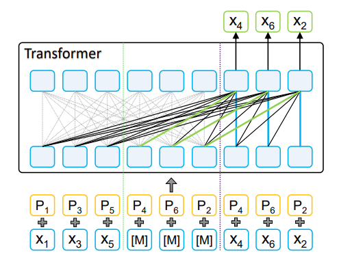
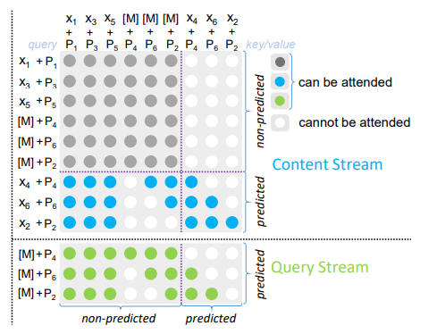

Semantic Search 

**Motivation:**

Semantic search is a method of information retrieval that considers the meaning or context of a query as well as the content of the documents in a database in order to go beyond typical keyword-based search. 
This strategy makes use of deep learning techniques to match and extract the semantic meaning of words and phrases, improving the relevance and accuracy of search results. Semantic search could be used in a variety of tasks as follows

Information Retrieval: Semantic search, especially for huge document collections or databases, can improve conventional information retrieval systems by delivering more precise and contextually relevant search results.

Search Engines: Semantic search approaches can help web search engines give users more pertinent search results, enhancing the user experience.

Document retrieval: Semantic search can assist users in finding pertinent documents quickly in document management systems or digital libraries based on their content.

Legal and medical information retrieval: Semantic search can make it easier for experts to locate pertinent court cases, medical literature, or patient records in fields like law and healthcare.

Systems for answering questions: When a user asks a question, semantic search can be used to find answers in documents. The machine can look for passages or publications that provide the solution that are pertinent.

Sentiment Analysis: Semantic search can be used to more fully comprehend the context and meaning of words or phrases when analysing sentiment in social media or customer reviews.

Recommending related articles: or news stories to viewers based on the information they are presently seeing is a function of news aggregators and media platforms that use semantic search.

Semantic Annotation: By assisting in the identification of entities, relationships, and concepts within the text, semantic search can be used to annotate documents or other content.

Enterprise Search: To enhance information retrieval from their databases, intranets, and repositories, large organisations might use semantic search in their internal systems.

Chatbots and Virtual Assistants: By comprehending the user's questions and looking up pertinent information or answers, virtual assistants can employ semantic search to give more precise answers.

Semantic search can be used to find connections between words and concepts, allowing for the automatic tagging or categorization of content based on its semantic meaning.

E-commerce Search: By identifying the purpose of a user's query and returning results that are semantically similar, e-commerce platforms can enhance product search.

**Challenges:**

Data Requirements: Training deep learning models for semantic search typically requires large amounts of text data. In this repository in-memory indexing method is used totackle this challenge.

Searching Large Embeddings: searching a large embeddings created from enermous datasets could be slow and storing embeddings of large amount of documents requires a large amount of memory. 
This could be overcome using elastic search or embedding database to store & match the embeddings of the articles against a query.

Computational Resources: Deep learning models are resource-intensive, both in terms of training and inference. In this repository 20K articles was used for training which consumed 3 hours of computation on i7 8th generation CPU utilizing 16 GB of memeory.

**1.1 Embedding Creation:** 
Embeddings are created using [MPNet](https://www.microsoft.com/en-us/research/uploads/prod/2020/11/NIPS_MPNet.pdf "MPNet") model that was developed by microsoft research team. 
MPNet "Masked and Permuted Pre-training for Language Understanding" is a training approach used in natural language understanding (NLU) models, and it builds upon the pre-training techniques that have been popularized by models like BERT (Bidirectional Encoder Representations from Transformers).

Pre-training: Similar to BERT, this method pre-trains a neural network model using a significant body of text data. The model gains the ability to anticipate missing or hidden words in a sentence during this pre-training phase, which aids in the model's ability to understand context and semantics.

Masked Language Modelling: The use of masked language modelling is indicated by the "masked" aspect. In this procedure, tokens or words chosen at random from the sentence are hidden, and the model is trained to identify them. It's a two-way task where the model makes predictions while taking the nearby words into account.

Permuted Language Modelling: This method includes "permuted language modelling" in addition to "masked language modelling." In this task, text chunks are shuffled or permuted, and the model is trained to figure out the right chunks to put in which order. This encourages the model to comprehend the text's overall coherence and structure.

Two-Stream Architecture: In a two-stream architecture, which processes input text in parallel, masked and permuted language modelling are combined. The permuted language modelling task is the focus of one stream, while the masked language modelling task is the focus of the other stream. As a result, the model can simultaneously learn global sentence structure and precise word predictions.

Benefits: This strategy enhances the model's general language understanding abilities while also helping to better understand the contextual relationships between words and to capture semantic information.
The model can be fine-tuned for particular NLP tasks, such as text classification, question answering, or language generation, after the pre-training phase. The model is modified through fine-tuning to function well in specific tasks and domains.

State-of-the-Art Performance: Models using the masked and permuted pre-training technique have produced enhanced results on a variety of NLP benchmarks and tasks, proving their prowess in understanding and generating natural language.

The structure of MPNet.

The attention mask of MPNet

**1.2 Benifits of MPNet**

Transformer Architecture: MPNet is built on the Transformer architecture, which has revolutionized NLP. Transformers use self-attention mechanisms to capture contextual relationships between words or tokens in a text, making them highly effective for various NLP tasks.

Massive Scale: What sets MPNet apart is its massive scale. It is one of the largest language models, with billions of parameters, enabling it to capture intricate patterns and nuances in language.

Pre-training: Like other pre-trained models, MPNet is pre-trained on a massive corpus of text data. This pre-training helps the model learn a broad understanding of language, including grammar, semantics, and world knowledge.

Megatron: The term "Megatron" refers to the underlying framework and methodology used to train MPNet. It includes data parallelism, model parallelism, and mixed precision training, allowing MPNet to be efficiently trained on a distributed computing infrastructure.

Multimodal: MPNet is designed to handle not only text but also multimodal data, such as text and images. This makes it versatile for tasks that involve both text and visual information.

**1.3 Dataset**

The data is taken from Kaggle. This dataset contains 20972 scientific articles including the article classification. This dataset could be found [here](https://www.kaggle.com/code/kerneler/starter-research-articles-dataset-3b827060-9/input).
The data is in CSV format and for the sake of simplicity, and resource limitation only the abstarct was used to create the embedding file.

**2 Indexing**

Two methods of search was used, normal search mode, and indexed search. The normal search mode, converts the seach query to an embedding then applies a cosine similarity matching. On the other hand, an index is created using faiss python library.
faiss is a library for efficient similarity search and clustering of dense vectors developed by META you can read about the details [here](https://github.com/facebookresearch/faiss).

**4 Production**

This approach could be suited for production mode if elastic search is employed, or an embedding database where embeddings are stored and matched using an advanced matching methods like cosine similarity or even methods similar to faiss.
The primary pipeline could also include creation of embedding on regular basis for real time search of articles. The proposed production mode is highly scalable and could utilize distibuted computing.

**5 Conclusion**

In summary, masked and permuted pre-training for language understanding is an extension of the pre-training approach, combining both masked language modeling and permuted language modeling in a two-stream architecture. This method has led to significant advancements in NLP tasks and has contributed to models with enhanced language understanding capabilities.
MPNet represents a significant advancement in the field of NLP, demonstrating the benefits of scaling up model size and training data. It is known for its impressive performance across a wide range of language understanding tasks and is a powerful tool for natural language processing applications.